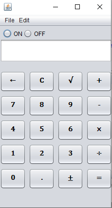
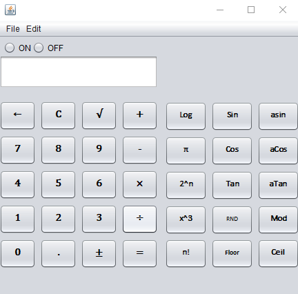
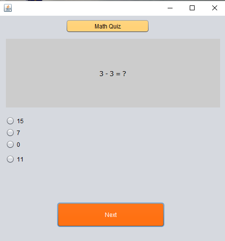
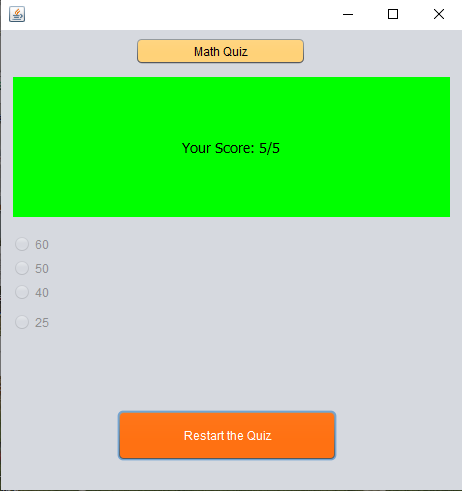
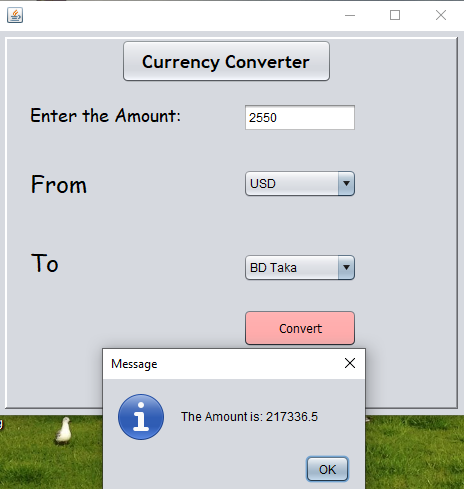

 

## Table of Contents
- [Introduction](https://github.com/mamutalib/Scientific_Calculator#introduction)
- [Projecdt Feature](https://github.com/mamutalib/Scientific_Calculator#project-feature)
- [Tools/Software used](https://github.com/mamutalib/Scientific_Calculator#toolssoftware-used)
- [Details of my work with the necessary screenshot](https://github.com/mamutalib/Scientific_Calculator#details-of-my-work-with-the-necessary-screenshot)
    - [Standard & Scientific Mode](https://github.com/mamutalib/Scientific_Calculator#standard--scientific-mode)
    - [Math Quiz](https://github.com/mamutalib/Scientific_Calculator#math-quiz)
    - [Currency Converter](https://github.com/mamutalib/Scientific_Calculator#currency-converter)
    - [Tik Tac Toe](https://github.com/mamutalib/Scientific_Calculator#tik-tac-toe)
- [Challenges](https://github.com/mamutalib/Scientific_Calculator#challenges-that-i-faced-to-do-this-project)
- [Conclusion and future work](https://github.com/mamutalib/Scientific_Calculator#conclusion-and-future-work)

## Introduction:
In the era of globalization, we used Calculator so many times. We use it to do the calculation in a short time. In this perspective, I have made a java Scientific Calculator software. By using this software, we can easily calculate our problem.  
 
## Project Feature:
In my software, I have designed 5 five features.  
Which are: 
- [Standard & Scientific Mode](https://github.com/mamutalib/Scientific_Calculator#standard--scientific-mode)
- [Math Quiz](https://github.com/mamutalib/Scientific_Calculator#math-quiz)
- [Currency Converter](https://github.com/mamutalib/Scientific_Calculator#currency-converter)
- [Tik Tac Toe](https://github.com/mamutalib/Scientific_Calculator#tik-tac-toe)
 
## Tools/Software used:
To build my software, I have used **Apache NetBeans IDE 12.2 software**. On the other hand, I have used **Java** language along with **Java GUI**.  

## Details of my work with the necessary screenshot:
As I mentioned before, I have designed five features in my project. Now I have written the details of my project. 
### Standard & Scientific Mode
 

This is the Standard Mode of my Scientific Calculator. Wherein we can calculate normal mathematical equations. Like, addition, subtraction, multiplication, division, and square root. On the run time of calculator, we can clear all the previous calculations by pressing c button. Likewise, it also possible to delete a single digit from calculator by pressing left arrow (←) sign button.  

The following image is the second feature of my software. By using Scientific Mode, we can get the value of Sin, Cos, Tan, and others. This feature is basically for doing Scientific mathematical operations. 

### Math Quiz:  

- This is the 3rd feature of my software. Here a user can take a math quiz.  
- It is the starting page of Math Quiz.  
 
- At the end of quiz, user will get the score of the quiz.  
- User can restart the quiz.  

### Currency Converter: 

This is the 4th feature of my project. 
Here user can convert a specific amount of money to one currency to another currency. In this screenshot I have shown a demo. Like The amount is: 256 
USD to BD Taka will be 21818.88.  
 

### Tik Tac Toe 
At last, I have added a minor game feature to my project. A user can play the game whenever he wants. There will be nine boxes to fill up. 

Here I have added a screenshot of this game.  
  
 
## Challenges that I faced to do this project:  
Basically, in this project I have faced some issues with completing this project. Most of the time, I faced implementing logic in coding. There are so many classes in the Java language that I’m not a well-known student to implement in the project. These kinds of issues I have faced in this project.  
Results:  
In my project, all the feature works perfectly except Tik Tac Toe game. There are some bugs that I couldn’t fix the last time.  
 

## Conclusion and future work:  
That is an excellent experience for me to do this project as a single member. And this project can be expanded with more advanced features. As like using if some automatic equations solver function is added, it will be more appropriate to this project.  
